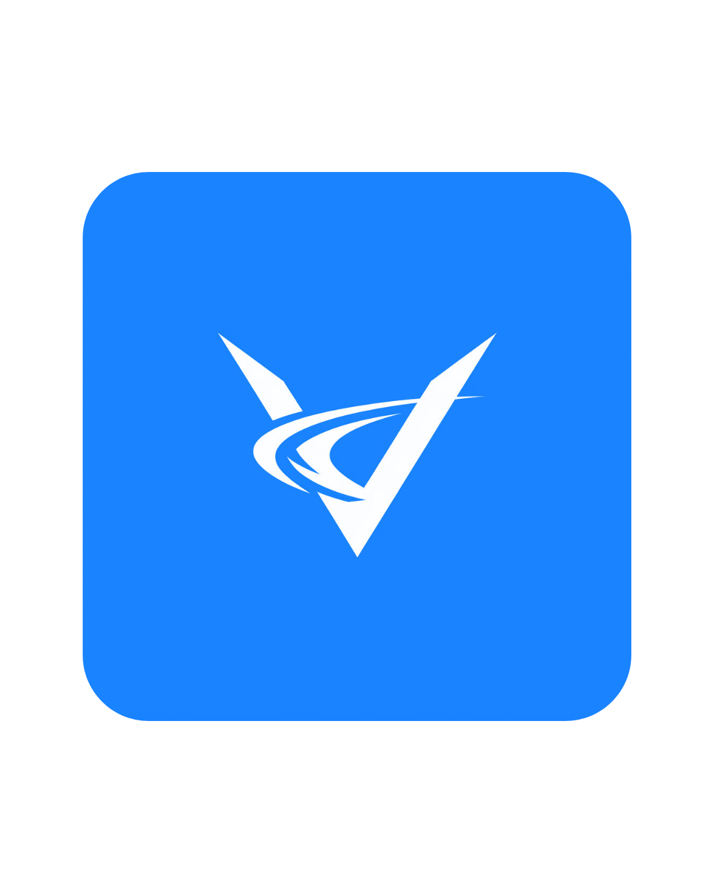

# VsToWarp

Convert your favorite Visual Studio Code color themes into Warp terminal themes with ease!

**VsToWarp** is a VS Code extension that bridges the gap between your editor and terminal by transforming VS Code color themes into formats compatible with the [Warp terminal](https://www.warp.dev/). Whether you want to export your current theme, all installed themes, or preview them before converting, this extension has you covered.

---

## Features

- **Export Current Theme**: Export the theme you’re currently using in VS Code to a Warp-compatible theme.
- **Export All Themes**: Batch-export all installed VS Code themes to Warp themes in one go.
- **Select and Export**: Pick any installed theme and export it to Warp with a simple selection.
- **Preview Before Export**: Test how a theme looks in VS Code before exporting it, with options to keep, export, or revert.

## Usage

1. **Open the Command Palette**:
   - Press `Ctrl+Shift+P` (or `Cmd+Shift+P` on macOS).

2. **Run a Command**:
   - `Warp Themes: Export Current Theme to Warp`: Converts your active VS Code theme.
   - `Warp Themes: Export All Installed Themes to Warp`: Converts all themes you have installed.
   - `Warp Themes: Select and Export Theme to Warp`: Choose a theme from your installed list to convert.
   - `Warp Themes: Preview Theme Before Export`: Preview a theme in VS Code, then decide to keep, export, or revert.

3. **Output**:
   - Converted themes are saved in a format compatible with Warp. Check the extension’s output channel or your project folder for the files.

---

## Example

Preview and export the "Dark+ (default dark)" theme:

1. Run `Warp Themes: Preview Theme Before Export`.
2. Select "Dark+ (default dark)" from the list.
3. Preview it in VS Code.
4. Choose "Keep & Export" to apply it and generate the Warp theme file.

---

## Requirements

- VS Code version `1.97.0` or higher.
- [Warp terminal](https://www.warp.dev/) installed to apply the converted themes.

---

## Contributing

Found a bug? Want to add a feature? Contributions are welcome!
- Fork the repo at [github.com/Vedant-Panchal/vstowarp](https://github.com/Vedant-Panchal/vstowarp).
- Submit a pull request with your changes.

---

## License

Licensed under the [MIT License](LICENSE).

---

## Acknowledgments
- Thanks to @nishantmehta07 for this cool logo ❤️.
- Built with ❤️ using TypeScript, Webpack, and the VS Code API.
- Thanks to the Warp team for inspiring terminal customization!
---

Questions? Issues? Reach out via the [GitHub Issues page](https://github.com/Vedant-Panchal/vstowarp/issues).
